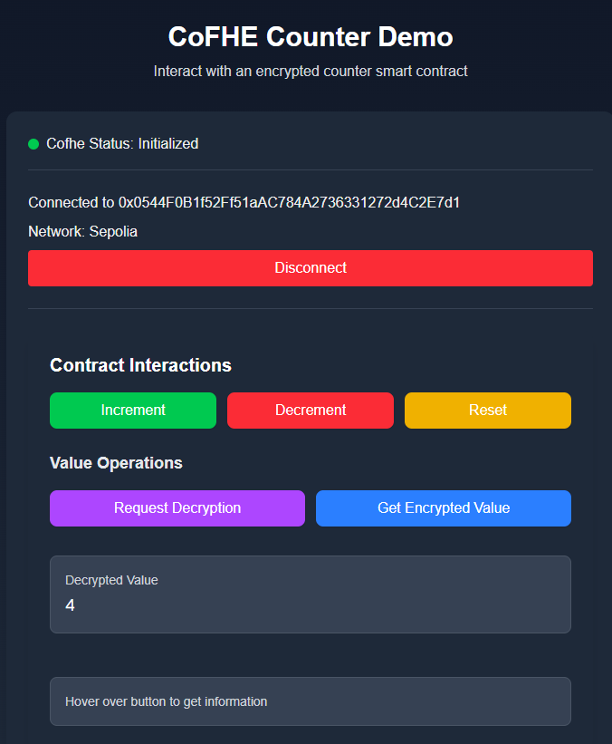

# Cofhe Templates

## Deployed Counter Contract
- Sepolia: `0x0D719dd073f4B3e36D0D263F4bb76F9B7E46D0c2`
- Arbitrum Sepolia: `0x83d6d706b9A597EF43c487e5E50c25b0Aa131b8a`

## Available Templates

- [x] Next.js - Smart Wallet Example (see below)
- [x] React (Vite)

## About cofhejs

[cofhejs](https://cofhe-docs.fhenix.zone/docs/devdocs/cofhejs) is a TypeScript library that enables seamless interaction with FHE-enabled smart contracts via the CoFHE service. CoFHE is a privacy-preserving computation service for EVM-compatible networks, currently supporting Ethereum Sepolia and Arbitrum Sepolia. The library handles encryption, decryption, and permit management, allowing dApps to keep user data private while leveraging fully homomorphic encryption on-chain.

- **Encrypt input data** before sending to smart contracts.
- **Create and manage permits** for secure access and decryption.
- **Unseal and decrypt** contract outputs for user display.

For more details, see the [cofhejs documentation](https://cofhe-docs.fhenix.zone/docs/devdocs/cofhejs).



*Example: CoFHE Counter Demo dApp using cofhejs for encrypted smart contract interactions.*

# Smart Wallet Integration with Privy + Permissionless (Next.js)

This project now includes Smart Wallet functionality using Privy.io and Permissionless with Pimlico paymaster for sponsored transactions.

## Environment Variables Required

Create a `.env.local` file in your project root with:

```env
# Get your App ID from https://dashboard.privy.io
NEXT_PUBLIC_PRIVY_APP_ID=your-privy-app-id-here

# Get your API key from https://dashboard.pimlico.io
NEXT_PUBLIC_PIMLICO_API_KEY=your-pimlico-api-key-here
```

## Setup Steps

1. **Privy Dashboard Setup**:
   - Go to [https://dashboard.privy.io](https://dashboard.privy.io)
   - Create a new app or use existing one
   - Copy your App ID
   - Configure allowed origins (e.g., `http://localhost:3000`)

2. **Pimlico Dashboard Setup**:
   - Go to [https://dashboard.pimlico.io](https://dashboard.pimlico.io)
   - Create an account and get your API key
   - Enable Sepolia testnet (or your preferred chain)

3. **Run the Application**:
   ```bash
   pnpm dev
   ```

## Features

- **Multi-modal Authentication**: Email, phone, social logins, external wallets
- **Smart Wallets**: Automatically created for users without wallets
- **Sponsored Transactions**: Gas-free transactions via Pimlico paymaster
- **Account Abstraction**: ERC-4337 compatible smart accounts

## How It Works

1. Users authenticate via Privy (email, social, etc.)
2. A smart wallet is automatically created using the Simple Account factory
3. The smart wallet can send sponsored transactions (no gas required from user)
4. Regular Wagmi hooks still work for contract interactions

## Testing

Once authenticated, you'll see:
- User ID and wallet addresses
- Smart wallet status
- A "Test Sponsored Tx" button to test gasless transactions

## Adaptor to Cofhejs

`useSmartWallet.ts` contains an adapter function `viemProviderSignerTransformer` for the SmartWalletClient.
It outputs a signer and provider that fit into the CoFHE.js initializer and keeps the whole flow the same.

